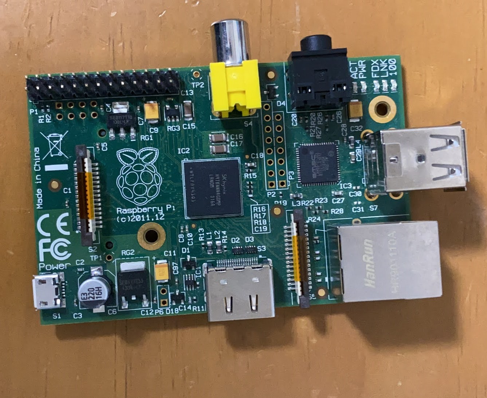

## 背景

Raspberry Pi を常時起動させていろいろ遊ぼうと思ったのですが、約 10 年前の物ということもありいきなり 24 時間稼働させるのは心配だったので、Raspberry Pi のテストと勉強も兼ねて CPU 温度を測定してみました。

## 使用する Raspberry Pi

Raspberry Pi Model B Revision 2.0



スペックは[こちら](https://www.pololu.com/product/2750)

## セットアップ方法

以下の記事を参考にさせて頂きました。

- [RaspberryPi をモニタ・キーボード無で OS セットアップ](https://blog.goo.ne.jp/pearlwing/e/bec69b769fa2b9e2132367b220bd4605)
- [Windows 10 で Raspberry Pi 4 のセットアップ方法まとめ](https://qiita.com/Yuukin256/items/e69fa13402dc87267b68)

現行モデルは micro SD カードなので Raspberry Pi Imager が使えるか心配でしたが普通の SD カードでも問題なく使えました。OS は Raspberry Pi OS Lite にしました。

## SD カード

Transcend SD カード 32GB UHS-I Class10 TS32GSDC300S-E

## CPU 温度測定方法

Python のプログラムを使って CPU 温度を CSV ファイルに記録していきます。

## CPU 温度を測るプログラム

```python
import subprocess
import csv
import datetime
import time

# Raspbianの制御コマンド（vcgencmd）を実行

with open('cpu_info.csv', 'w') as f:
    writer = csv.writer(f)
    writer.writerow(['time', 'temp', 'clock', 'volt', 'arm', 'gpu'])


while(1):

    # 現在時刻を取得する
    dt_now = datetime.datetime.now()
    dt_time = f"{dt_now.day} {dt_now.hour}:{dt_now.minute}:{dt_now.second}"

    # 温度を取得するRPiコマンド
    temp = subprocess.getoutput("vcgencmd measure_temp").split('=')

    # CPU周波数を取得
    clock = subprocess.getoutput("vcgencmd measure_clock arm").split('=')

    # 電圧を取得
    volt = subprocess.getoutput("vcgencmd measure_volts").split('=')

    # CPU(arm),GPUのメモリ使用量
    arm = subprocess.getoutput("vcgencmd get_mem arm").split('=')

    gpu = subprocess.getoutput("vcgencmd get_mem gpu").split('=')

    with open('cpu_info.csv', 'a') as f:
        writer = csv.writer(f)
        writer.writerow(
            [dt_time, temp[1], clock[1], volt[1], arm[1], gpu[1]])


    time.sleep(5)
```

CPU 温度以外にも色々測ってみました。ssh を切った後も動いてほしいので nohup コマンドを利用してバックグラウンドで起動させる必要があります。

## CSV ファイルの中身


こんな感じで記録していきます。

## CPU 温度測定結果

5 月中旬のある日に寝てから次の日出かけて帰ってくるまで約 15 時間ほど測定してみました。データの数が多すぎたので適当に間引いています。44.5℃ 付近で安定しているように見えます。


## 感想

約 10 年前の Raspberry Pi ということで常時起動させるのは心配でしたが、この感じなら行けそうです。夏場が少し心配ですが。また OS を 1 から自分でインストールするのは初めてだったのでいい経験になりました。

## 参考

- [Raspberry Pi Model B, Revision 2.0](https://www.pololu.com/product/2750)
- [RaspberryPi をモニタ・キーボード無で OS セットアップ](https://blog.goo.ne.jp/pearlwing/e/bec69b769fa2b9e2132367b220bd4605)
- [Windows 10 で Raspberry Pi 4 のセットアップ方法まとめ](https://qiita.com/Yuukin256/items/e69fa13402dc87267b68)
- [RaspberryPi の CPU 情報を Python で取得する](https://qiita.com/Fendo181/items/a1fde032377337af3264)
